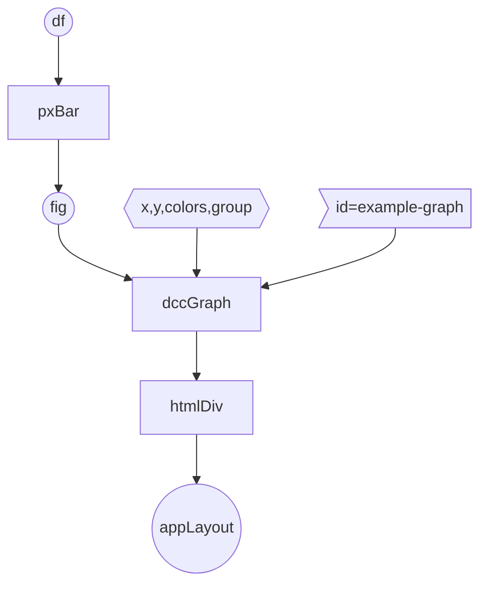

# Chapter 2, sample app flowchart

```mermaid
flowchart TD

    df((df)) --> pxBar
    pxBar --> fig((fig))
    fig --> dccGraph
    dccGraph --> htmlDiv
    recipe{{x,y,colors,group}} --> dccGraph
    figId>id=example-graph] --> dccGraph
    htmlDiv --> layout((appLayout))
```
